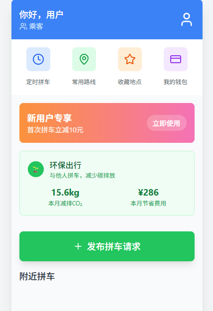

# 手机拼车--软件工程课程作业仓库
同济大学软件工程课程小组作业--手机拼车软件仓库
# 🚗 CarPool - 智能拼车应用

**前端：React | 后端：Flask | 数据库：MySQL**

## 🌟 项目简介

一个拼车平台APP，连接司机和乘客，实现高效共乘。本仓库包含完整的React前端和Flask后端实现。

## 🛠️ 技术栈

### 前端
- React 18 + TypeScript
- Redux Toolkit 状态管理
- Ant Design 组件库
- 高德地图API
- WebSocket 实时通信

### 后端
- Flask + Flask-RESTful
- SQLAlchemy ORM
- JWT 认证
- Redis 缓存
- Celery 异步任务

### 后端设置
cd server
python -m venv venv
source venv/bin/activate  # Linux/Mac
venv\Scripts\activate  # Windows
pip install -r requirements.txt
flask run
### 前端设置
cd client
npm install
npm start

### 项目结构

.
├── client/                 # 前端代码
│   ├── public/            # 静态资源
│   └── src/               # React源码
│       ├── api/           # API请求
│       ├── components/    # 通用组件
│       ├── pages/         # 页面组件
│       ├── store/         # Redux状态
│       └── utils/         # 工具函数
│
├── server/                # 后端代码
│   ├── app/               # 应用代码
│   │   ├── api/          # API路由
│   │   ├── models/       # 数据模型
│   │   └── services/     # 业务逻辑
│   ├── migrations/       # 数据库迁移
│   └── config.py         # 配置文件
│
├── docs/                  # 项目文档
└── scripts/               # 部署脚本

🤝 贡献指南
Fork 本项目

创建新分支 (git checkout -b feature/your-feature)

提交更改 (git commit -am 'Add some feature')

推送到分支 (git push origin feature/your-feature)

创建Pull Request 

# 禁止直接Pull main分支！！！

Tongji License © 2025 LMQ WWJ WWY

